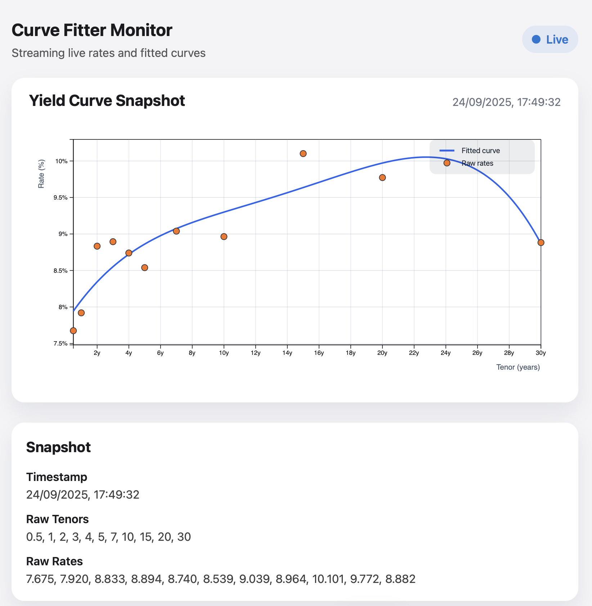

# Curve Fitter UI



A React + D3 single page app that streams yield curves over SSE and renders the live fit.

## Local Development

- Install dependencies: `npm install`
- Start the dev server: `npm run dev`
- The Vite proxy forwards `/curves` requests to `http://localhost:8000`.

## Docker

Build a local image:

```bash
docker build -t curve-fitter-ui:latest .
docker run --rm -p 8080:80 \
  -e STREAM_URL="http://localhost:8000/curves/stream" \
  -e APP_ENV="prd" \
  curve-fitter-ui:latest
```

### Runtime configuration

- `STREAM_URL` controls the SSE endpoint the UI connects to. Override it when starting the container, e.g. `-e STREAM_URL="http://backend:8000/curves/stream"`.
- `APP_ENV` labels the environment (`prd` by default). The UI reads both values from `config.js`, which is generated from `config.template.js` during container start-up.

## Continuous Delivery to GHCR

A GitHub Actions workflow at `.github/workflows/docker-publish.yml` builds the Docker image and pushes it to GitHub Container Registry (GHCR).

### When it runs
- Any push to `main`
- Tag pushes that start with `v` (for example `v1.2.0`)
- Pull requests (build only, no push)
- Manual trigger via the **Run workflow** button

### Registry destination
Images are published to:

```
ghcr.io/<github-owner>/<repo>
```

For example, pushing to `main` in `your-org/curve_fitter_ui` creates `ghcr.io/your-org/curve_fitter_ui:main`.

The workflow builds multi-architecture images (`linux/amd64` and `linux/arm64`) and applies a `latest` tag for the default branch so the image works on both Linux and macOS hosts.

### Repository configuration
1. Ensure `Settings → Actions → General → Workflow permissions` grants the default `GITHUB_TOKEN` **Read and write** access to packages.
2. (Optional) Update the workflow if you prefer a different tag strategy or registry.

No additional secrets are required—the workflow logs in with the provided `GITHUB_TOKEN`.

---

Olivier Bonnemaison · https://github.com/bonnemai/curvefitter_ui
